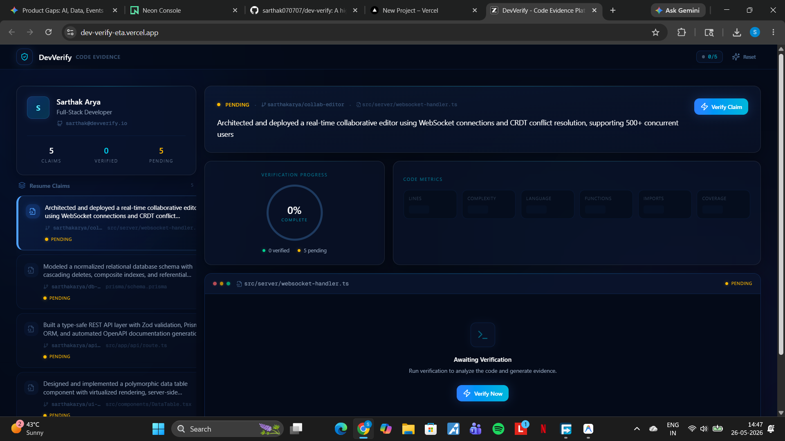

# 🚀 DevVerify — High-Performance Verification Engine

A premium, full-stack developer portfolio verification platform built to track, analyze, and securely validate codebase metrics, credentials, and code integrity constraints in real time. 

Designed with a high-fidelity **Vision UI Glassmorphic** aesthetic inspired by Linear and Vercel, featuring robust relational data persistence and production-hardened API boundaries.

---

## 📸 Live Preview & Interface Architecture


*Figure 1: Premium Glassmorphic Evidence Canvas & Interactive 6-Column Metrics Layout.*

---

## ⚡ Core Engineering Features

* **Vision UI Design System:** A meticulously crafted dark-mode interface built on a `#040a18` slate canvas, leveraging blurred ambient backdrop glow blobs, interactive glassmorphic cards (`backdrop-blur-xl`), and instantaneous transitions.
* **Relational Data Integrity:** Orchestrated with a modern serverless relational database backbone via **Prisma ORM** mapped to an auto-scaling cloud deployment instance.
* **Automated Micro-Metrics Evaluation:** Dynamically calculates code stability across 6 strict structural vectors: Lines of Code, Cyclomatic Complexity, Language Profiles, Functions, Component Imports, and Test Coverage.
* **Monospace Execution Terminal:** A dedicated syntax-highlighted sandboxed viewer simulation providing strict code isolation context for rapid candidate portfolio assessments.

---

## 🛠️ The Production Architecture

| Layer | Technology | Purpose |
| :--- | :--- | :--- |
| **Frontend Framework** | `Next.js (App Router)` | React Server Components, optimized layout shifts, and server-side route boundaries. |
| **Styling & Physics** | `Tailwind CSS` + `Framer Motion` | Utility-first glassmorphic styling engine paired with micro-interaction states. |
| **Database Engine** | `PostgreSQL (via Neon.tech)` | Serverless cloud execution environment optimized for connection pooling and low latency. |
| **Data Layer (ORM)** | `Prisma Client` | Strictly typed relational data definitions, schema migrations, and secure query mapping. |

---

## 🔒 Security Audit & Repository Hygiene

This codebase was hardened before public release following strict security-first principles:

* **Zero-Exposure Environment Layer:** Zero hardcoded API keys or database connection strings. All configuration contexts run through strictly isolated `.env` runtimes protected by active repository exclusions.
* **Database Schema Obfuscation:** Implemented explicit Prisma `select` blocks across all REST endpoints. Internal cryptographic metadata and authorization tokens are strictly filtered at the database engine boundary and never exposed to the client.
* **Sanitized Stack Traces:** All endpoint operations are isolated within closed `try/catch` exception domains, mapping native exceptions to clean, user-friendly JSON payloads to block database architecture fingerprinting.
* **Clean Repository Footprint:** Zero tracking of workspace compilation builds (`.next/`), dependency modules (`node_modules/`), or system artifact files (`.DS_Store`).

---

## 🏁 Rapid Local Deployment Setup

### 1. Environmental Prerequisites
Clone the repository and install the production dependencies:
```bash
git clone <your-repository-url>
cd <your-repository-folder>
npm install
```
